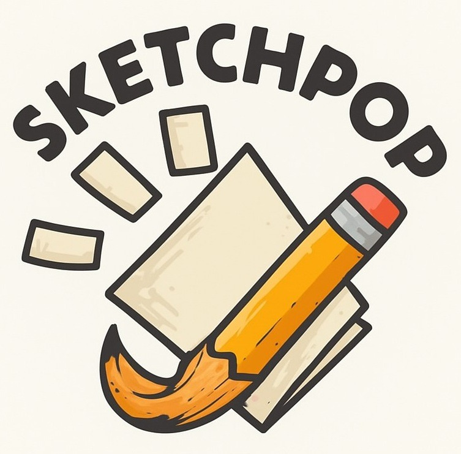
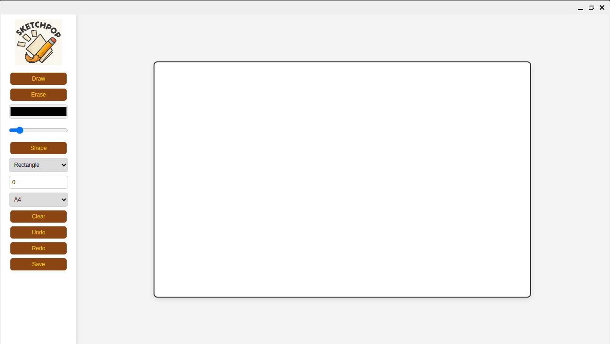

# 🎨 SketchPop

SketchPop is a modern, browser-based drawing application powered by a Qt backend. It enables users to sketch, draw shapes, and design on a digital canvas with ease and precision.

## 🚀 Features

- ✏️ Freehand sketching with smooth brush strokes
- 🟦 Shape drawing tools (rectangles, circles, lines, etc.)
- 🎨 Color selection and fill options
- 💾 Save and export your artwork
- 🌐 Runs in the browser with a responsive UI
- ⚙️ Qt-powered backend for performance and flexibility

## 🖼️ Interface & Logo

